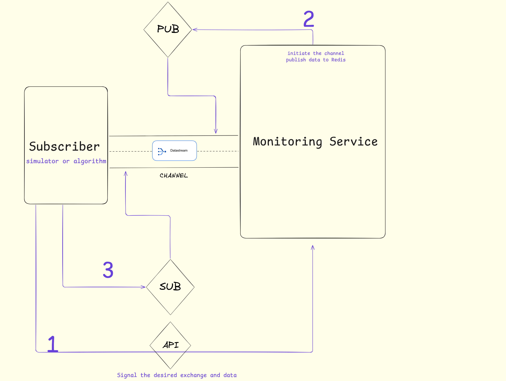

# Introduction

This service is designed to provide market data (trading pairs) from various cryptocurrency exchanges. The architecture is built to be independent and decoupled from other services to ensure scalability, flexibility, and maintainability.

Upon receiving a subscription signal from external services, the system initializes a dedicated data stream for the requested exchange and publishes real-time market data to a specific communication channel.

# Service Design

Based on the provided sketch, the service consists of three main components:

### 1. API Gateway  
- Receives subscription signals from external services.
- Acts as the main entry point to the system.

### 2. Core Service  
- Initializes per-exchange services to fetch live market data.
- Handles multiple exchanges concurrently using asynchronous programming (`asyncio`).

### 3. Channel Manager  
- Manages real-time data channels using Redis Pub/Sub.
- Publishes market data into specific channels for consumption.

## 🛠️ Tech Stack

| Component        | Technology            | Description                                                                 |
|------------------|------------------------|-----------------------------------------------------------------------------|
| **API Layer**     | [FastAPI](https://fastapi.tiangolo.com/) | High-performance Python framework with async support and automatic docs     |
| **Concurrency**   | `asyncio` / `anyio`    | Handles concurrent exchange data collection efficiently                     |
| **Data Channels** | [Redis Pub/Sub](https://redis.io/docs/manual/pubsub/) | Lightweight real-time messaging for broadcasting data streams               |
| **Language**      | Python 3.10+           | Main programming language across all components                             |
| **Other Tools**| Docker, Pydantic | For containerization, validation, and monitoring                             |

